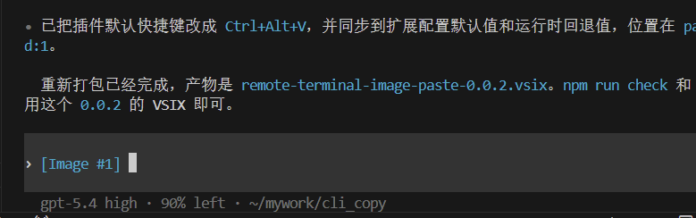

# Remote Terminal Image Paste

一个专门面向 `Windows 本地 VS Code + Remote-SSH + Ubuntu 远端终端` 的 VS Code 扩展。

它只做一件事：
- 从 Windows 本地剪贴板读取截图
- 通过 VS Code 的远端文件系统 API 写到远端工作区
- 把远端图片路径或 `@路径` 这样的引用文本插入当前终端

现在这个版本只保留已经验证可行的 `remoteFs` 方案，不再包含实验性路线。

本仓库额外附带了一份中文安装教程 `安装教程.md`，适合在源码目录里查看。

## 当前功能

- 终端粘贴图片到远端工作区
- 非图片剪贴板时自动回退为普通终端粘贴
- 远端图片目录自动写入 `.gitignore`
- 支持按数量和按天数清理历史图片
- 支持路径插入模板
- 支持在插件设置中切换快捷键档位

## 命令

- `Remote Terminal Image Paste: Paste Image To Remote Terminal`
- `Remote Terminal Image Paste: Cleanup Saved Images`

## 默认快捷键

默认是 `Ctrl+Alt+V`。

你可以在扩展设置里切换：

- `Ctrl+Shift+V`
- `Ctrl+Alt+V`
- `Alt+V`
- `None`

如果选 `None`，就只保留命令面板命令，不注册快捷键。

## 关键设置

```json
{
  "remoteTerminalImagePaste.shortcut": "ctrlAltV",
  "remoteTerminalImagePaste.remoteDirectory": ".vscode-ai-images",
  "remoteTerminalImagePaste.insertTemplate": "{path}"
}
```

如果你主要给 Claude Code 用，建议这样：

```json
{
  "remoteTerminalImagePaste.shortcut": "ctrlAltV",
  "remoteTerminalImagePaste.insertTemplate": "@{path}"
}
```