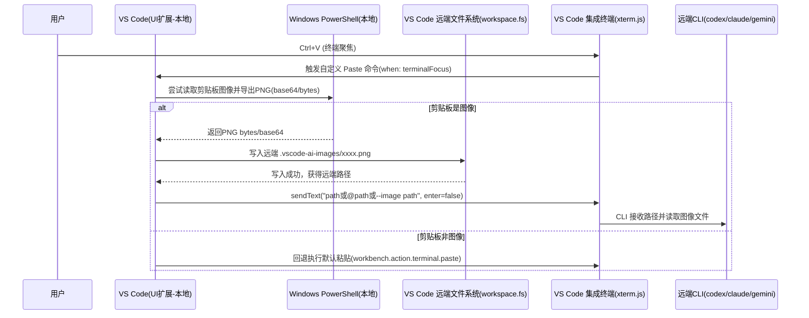

# Windows VS Code Remote-SSH 场景下远程终端无法直接粘贴本地剪贴板截图的原因与插件化解决方案深度研究报告

## 执行摘要

在“Windows 本地 VS Code（非 WSL）+ Remote-SSH 连接远程 Ubuntu + VS Code 集成终端运行 CLI 工具（codex cli / Claude Code / Gemini CLI 等）”这一链路中，**无法把 Windows 剪贴板中的截图（图像）直接粘贴进远程终端里的 CLI**，核心并非某个单点 Bug，而是多层设计叠加导致的“能力缺口”：Windows 剪贴板对截图通常以 **DIB/位图等二进制格式**存储；而 VS Code 扩展的官方剪贴板 API **仅提供文本读写**，集成终端（基于 xterm.js）在 PTY/SSH 交互层面也将数据**序列化为字符串**并通过伪终端传输，从而天然把“粘贴”限定为文本流。citeturn5search0turn3view1turn24view0

因此，可落地的工程思路不是“让终端支持粘贴图片（二进制）”，而是**在粘贴动作发生时由 VS Code 插件截获**：从 Windows 剪贴板提取图片 → 转为 PNG/JPEG → **写入远程工作区/临时目录** → 在终端中“粘贴”一段能被 CLI 接收的文本（最常见是**远程文件路径**，或按需插入 `@path`/参数模板）。这一模式已在现有扩展中得到验证：例如 *SSH Screenshot Paste* 会在 Remote-SSH 会话里捕获粘贴并将本地截图保存到远程目录，然后把路径“打字”到终端。citeturn26view1turn26view3

本报告给出面向你要开发的 VS Code 插件的深度方案：优先推荐“**本地 UI 扩展读取剪贴板图像 + workspace.fs 写入远程 + 终端插入路径**”，并提供可执行的插件架构、关键 API 伪代码、图片格式处理与清理策略，以及与 Codex/Claude/Gemini 类 CLI 的集成方式（以“路径输入”为主，必要时支持 base64/数据流备选）。citeturn16search0turn15search0turn15search2

## 背景、关键约束与假设

你的目标场景具有几个“强约束”：

1) **本地端**：Windows 上运行 VS Code（不是 WSL 里的 VS Code），用户截图后图像进入 Windows 系统剪贴板（常见为 DIB/位图/PNG 等格式）。citeturn5search0  
2) **连接方式**：使用 VS Code Remote-SSH 打开远程 Ubuntu 上的工程，并在 VS Code 集成终端里运行远程 CLI。Remote-SSH 通过在远端部署 VS Code Server，使本地 VS Code 能操作远端文件系统与进程环境。citeturn18search16turn25view0  
3) **交互目标**：用户想在“远程终端输入区”执行粘贴，把本地剪贴板的**图像内容**传递给 CLI（或通过插件把其转换成 CLI 可接收的文本输入，例如：上传为文件并插入路径，或以 base64/数据流间接传输）。

你明确指出若干未指定项。为避免方案与实际环境冲突，本报告将这些不确定点显式列为“假设/未指定项”，并在推荐方案中给出可切换策略：

**假设/未指定项清单（需你在立项时确认）**  
- 是否允许在远程 Ubuntu 上写入临时文件（例如工作区下 `.vscode-*` 目录）并由 CLI 读取。  
- 是否允许在远程端额外安装依赖/守护进程（daemon），或必须“零远端安装、零特权”。  
- 是否允许修改目标 CLI（codex/claude/gemini）或只能把它们当黑盒。  
- 网络/安全策略：是否限制远端出网、是否有 DLP/审计要求、是否禁止把截图写入磁盘。  
- 用户交互授权：是否允许弹窗确认/选择目录/重命名，还是必须“无感替换 Ctrl+V”。  
- 文件大小与敏感度：截图可能包含隐私/机密，是否要求强制二次确认、加密落盘、短期自动删除。  

## 技术原因分析：从 Windows 剪贴板到 VS Code Remote-SSH 终端链路

### Windows 剪贴板中的“截图”通常不是文本

Windows 剪贴板支持多种标准格式；图像常见以位图/设备无关位图等格式存在（如 CF_DIB、CF_DIBV5 等），也可能附带 PNG 等注册格式，具体取决于截图工具/浏览器实现。citeturn5search0  
这意味着“Ctrl+V 粘贴”的真实内容在 OS 级别未必有任何可直接映射为 UTF-8 文本的表示。

### VS Code 扩展的官方剪贴板 API 仅支持文本

VS Code 扩展 API 中 `vscode.env.clipboard` 只提供 `readText()` / `writeText()`。这在设计上就把扩展作者限制在“文本剪贴板”范畴内；若要读取图像，必须借助外部程序或原生模块（不属于官方稳定 API 能力）。citeturn3view1

### VS Code 集成终端的数据通道是“字符串 + PTY”，粘贴天然是文本流

VS Code 官方文档明确指出：集成终端基于 xterm.js，实现类 Unix 风格终端，“将所有数据序列化为字符串并通过伪终端（pseudoterminal）管道传输”。citeturn24view0  
这句话对你的问题非常关键：**终端输入输出层默认就是“字符流”**。即便你能在本地捕获到图像二进制，也不能直接通过“粘贴事件”把原始二进制透明送入远端 shell/CLI，而必须先把它编码为文本（base64/hex）或换用文件传输通道。

此外，VS Code 集成终端确实支持显示图像（Sixel 或 iTerm inline image 协议，需开启设置），但这是“输出渲染能力”，与“从本地剪贴板向远端输入图像”是两件事，不能直接推导出“支持粘贴图片”。citeturn24view0

### SSH 协议本身不提供“剪贴板通道”，粘贴发生在客户端侧

Remote-SSH 本质仍是通过 SSH 到远端执行与转发；SSH 标准会话是字节流/通道复用，并没有“把本地 OS 剪贴板对象发送到远端应用”的内建机制。Remote-SSH 的价值在于把远端文件系统与扩展宿主抽象进 VS Code 的通道中，而不是扩展 SSH 本身的语义。citeturn18search16turn25view0  
因此，**想把“剪贴板图像”送到远端**，最合理的做法是：利用 VS Code 既有的远端文件系统/命令执行通道来“搬运文件”，再在终端中输入“可被 CLI 理解的文本引用”。

### OSC52 不是“粘贴图片到远端”的通用解：方向相反、且有安全/大小/兼容性约束

OSC52（Operating System Command 52）在 xterm 控制序列中用于“Manipulate Selection Data”，其数据通常以 base64 编码放入控制序列中，供终端仿真器与系统剪贴板交互。citeturn13view1  
现实工作流里，OSC52 更常用于**从远端会话把文本复制到本地系统剪贴板**。终端仿真器对“读取本地剪贴板（paste）”的支持往往更谨慎：例如 Windows Terminal 社区长期讨论是否支持通过 OSC52 发起“粘贴请求”，并明确提到安全顾虑与需要用户确认。citeturn14search3  
同时，终端对 OSC52 的支持并不一致：micro 编辑器文档就指出“终端剪贴板（OSC52）在终端模拟器间支持有限”，并列举了不同终端对读/写的差异。citeturn14search10  

大小方面，很多实践文章会提到 OSC52 单次可承载长度存在常见上限（例如 100000 字节级别，且 base64 后有效载荷更小），因此用 OSC52 传图片（动辄数百 KB 甚至 MB）在性能与兼容性上都不理想。citeturn14search1  
结论是：**OSC52 可以作为“文本剪贴板桥”的知识背景与备选，但不应作为你插件的主通道**。

### 目标 CLI 工具普遍更可靠的入口是“文件路径/附件引用”，而非二进制粘贴

面向你列举的工具，可以观察到以下趋势（与插件策略强相关）：

- Claude Code 官方工作流建议：当需要处理图片时，**提供图片路径**让 Claude 分析图像内容。citeturn16search0  
- OpenAI Codex CLI 官方说明：Codex CLI 在 Windows 上属于实验支持，并建议更佳 Windows 体验使用 WSL；这意味着你在“Windows 原生 + Remote-SSH”场景更应依赖通用机制（文件路径），而不是指望 CLI 在该环境对剪贴板图片有一致能力。citeturn15search11  
- Codex 社区讨论中也出现“已支持：把图片路径粘贴到输入”这种使用方式，进一步印证“路径引用”是实际可用入口之一。citeturn15search0  
- Gemini CLI 相关 issue 专门请求“支持图片/截图输入”，说明至少在部分时期/版本下，这种能力并非默认具备，插件更应提供“上传文件并插入引用”的中间层。citeturn15search2  

## 现有方案与开源项目评估

下表选取与你需求最相关、可直接借鉴实现手法的项目与工具（包括你点名的部分），并给出简要评估。为满足“可追溯”，每项都给出源码/页面与许可信息；若许可在已抓取资料中未能确认，会明确标注“未核实”。

| 项目/实现（源码/页面） | 解决的子问题 | 与你插件的可复用点 | 优点 | 局限/注意点 | 许可 |
|---|---|---|---|---|---|
| VS Code 官方：Remote-SSH 文档 citeturn18search16 | 远程开发与远端文件系统/终端集成 | 你的插件可把图片文件写入远端“任意目录/工作区”，并在终端中引用 | 官方支持、稳定 | 不提供“剪贴板图像”能力，需要扩展实现 | 文档（无适用许可项） |
| VS Code 官方：Remote Extensions 架构说明 citeturn25view0 | UI 扩展 vs Workspace 扩展运行位置差异 | 你需要 **UI 扩展能力读取本地剪贴板**，同时用 VS Code API 与远端交互 | 解释清晰：哪些代码跑本地、哪些跑远端 | UI 扩展不要用 Node `fs` 访问远端，需走 VS Code API | 文档（无适用许可项） |
| SSH Screenshot Paste（VS Code 扩展）citeturn26view1turn26view3 | 在 Remote-SSH 远程终端里粘贴截图：保存到远端并插入路径 | **核心模式与你目标高度一致**：检测剪贴板是否为图片→写入远端→终端插入路径 | UI 侧无感接管粘贴；带远端目录、gitignore、清理等工程细节 citeturn26view1 | macOS 方案依赖 `pngpaste`；你需要 Windows 等价实现 | MIT citeturn26view1turn26view3 |
| Terminal Paste Image（VS Code 扩展）citeturn26view0turn19search16 | 在 VS Code 终端中粘贴剪贴板图像并插入路径 | 可参考其终端集成与路径插入交互（同类产品思路） | 聚焦“终端粘贴图片→路径”工作流 | 需要核对其 Remote-SSH 行为与 Windows 支持细节（报告未深入读源码） | MIT citeturn19search16 |
| Claude Code Image Paste (WSL)（市场扩展）citeturn26view2 | Windows+WSL 场景：保存图像并插入（含 `@` 前缀、清理、gitignore） | `@` 前缀、保留最近 N 张、自动 gitignore 等“产品化细节”可借鉴 citeturn26view2 | 明确面向 AI CLI 场景 | 主要为 WSL 路径转换设计；Remote-SSH 与 Windows 原生剪贴板读取仍需你适配 | 未核实（市场页未给出）citeturn26view2 |
| Paste Image（mushan.vscode-paste-image）citeturn30view0 | 在编辑器里粘贴图片并生成路径（面向 Markdown/AsciiDoc） | 路径模板、命名/前后缀、插入模式等配置系统可借鉴 | 成熟、广泛使用；README 中明确 MIT citeturn30view0 | 主要面向“编辑器文本插入”，不是终端粘贴；Remote-SSH 终端需要额外逻辑 | MIT citeturn30view0 |
| win32yank citeturn17search2 | Windows 剪贴板桥接工具（常用于 Vim/Neovim） | 提供“Windows 剪贴板 CLI 化”的思路 | 轻量、被广泛使用 | 主要处理文本/剪贴板交互；图像支持需验证 | ISC citeturn17search2 |
| wl-clipboard（wl-copy / wl-paste）citeturn17search3 | Linux Wayland 剪贴板命令行工具 | 可作为你插件在 Linux/Wayland 上的可选实现参考（若将来做跨平台） | 管道友好，适用于无 GUI 程序交互 citeturn17search3 | 与你当前 Windows→Remote-SSH 方案关联较弱 | GPL-3.0 citeturn17search3 |
| xsel（X11 selection 工具）citeturn28view0 | X11 剪贴板/选择区读写 | 可作为“远端有 GUI/X11”时的工具参考 | 功能成熟，文档/许可文本清晰 citeturn28view0 | 依赖 X11；Remote-SSH 常见服务器无 GUI | 许可文本为 MIT 风格授权条款（仓库 COPYING 给出授权文本但未命名）citeturn28view0 |
| xclip（X11 clipboard 工具的 GitHub fork）citeturn27search28 | X11 clipboard 命令行交互 | 同上，X11 环境可用 | 广泛存在于发行版 | Remote-SSH 场景通常无 X11；且此处引用为 fork | GPL-2.0 citeturn27search28 |
| rclone citeturn27search2turn27search6 | 云/远端文件同步（“云端 rsync”） | 作为“把截图同步到远端再引用”的备选（尤其跨多台远端） | 通道丰富、可加密/分块（取决于配置） | 引入外部依赖与配置复杂度较高 | MIT citeturn27search2turn27search6 |
| sshfs（libfuse/sshfs）citeturn28view1 | SFTP 挂载远端目录到本地 | 可实现“本地保存截图→远端同路径可见→插入路径”的替代路线 | 无需自建上传 API；利用 SFTP | 对 Windows 下体验/权限/性能需额外评估；且引入 FUSE/挂载 | GPL-2.0 citeturn28view1 |
| xterm OSC52 规范（xterm 控制序列）citeturn13view1 | 用 escape sequence 操作 selection/clipboard（base64） | 作为协议背景：解释为何“终端剪贴板”多为文本且依赖终端支持 | 权威来源 | 不适合大图/粘贴方向受限 | 文档（无适用许可项） |
| Windows Terminal 关于 OSC52 paste 的安全讨论 citeturn14search3 | 为什么“允许远端读取本地剪贴板”很敏感 | 为你的插件权限/确认流程提供安全依据 | 来自终端项目维护讨论 | 不能直接给出实现，只说明风险 | 讨论帖（无适用许可项） |

关键观察：**最贴近你目标的可复用范式已经出现**——“写入远端文件 + 在终端插入路径”。SSH Screenshot Paste 明确指出“扩展运行在本地、通过 `workspace.fs` 写远端、再输入路径”，这几乎就是你要在 Windows 上复刻并工程化的模式。citeturn26view3

## 可行实现方案对比

下表按你要求至少覆盖五类方案，并从复杂度、兼容性、安全、体验、性能、是否需要远端组件进行比较。结论将为后续“推荐方案”做铺垫。

| 方案 | 核心思路 | 实现复杂度 | 兼容性（Windows/Ubuntu/终端/CLI） | 安全风险 | 用户体验 | 性能/稳定性 | 是否需要远端安装组件 |
|---|---|---|---|---|---|---|---|
| OSC52 传输（把图片 base64 放入控制序列/或进文本流） | 将图片编码为 base64（文本），通过终端可见通道发送；必要时远端再解码写文件 | 高：需处理巨大数据、分块、重组、转义；终端/复用器差异大 | 不稳定：OSC52 依赖终端支持与策略；且“读剪贴板/粘贴”方向更受限 citeturn13view1turn14search10turn14search3 | 高：终端对“读取本地剪贴板”通常谨慎，涉及安全确认 citeturn14search3 | 一旦成功可“纯终端”；但失败/截断概率高 | 对大图非常不友好；常见实现还存在长度上限（实践常提 100000 字节级）citeturn14search1 | 可能需要远端解码脚本/工具（至少 shell + base64） |
| 本地插件上传到远端临时文件 + 终端插入路径 | UI 扩展读 Windows 剪贴板图像 → 写入远端目录 → `sendText` 插入路径/模板 | 中：主要是剪贴板取图与远端写文件 | 高：终端仅需接收文本路径；CLI 大多可用“路径输入”工作流 citeturn16search0turn15search0 | 中：截图落盘与可见性需治理（gitignore/清理/确认） | 极佳：接近“像粘贴一样”；已有同类扩展验证 citeturn26view1turn26view3 | 稳定：传输走 VS Code 通道；对大图更友好 | 不需要（只要能写远端工作区/某目录）citeturn18search16 |
| 使用 VS Code 远端文件系统 API/同步（SFTP/rsync/rclone）并插入路径 | 插件/外部工具把图片同步到远端，再插入可访问路径 | 中-高：取决于你是否复用 VS Code API 还是外部同步工具 | 中-高：工具链越多兼容性越复杂；但 rclone/sshfs 在某些团队更标准化 citeturn27search2turn28view1 | 中：需管理凭据、同步范围、误上传风险 | 中：可能不是“即时粘贴”，但可批量/可复用 | 大文件更好，但引入外部依赖与失败模式 | 可能需要用户安装/配置同步工具 citeturn27search2turn28view1 |
| 本地代理/守护进程 +（可选）端口转发，远端写入 | UI 插件把图发给本地服务；远端通过转发/客户端写文件 | 高：需要协议、鉴权、生命周期管理 | 中：网络策略/端口策略影响大；企业内可能受限 | 高：引入常驻服务与额外攻击面 | 体验可做到很顺滑，但部署重 | 性能好（可流式/断点），但复杂度最高 | 通常需要远端或本地安装组件（至少本地服务） |
| 创新方案：Webview + HTTP 上传（走 VS Code 通道/远端服务） | Webview 作为 UI，允许用户确认/编辑元数据并上传；远端生成路径/引用 | 中-高：要处理 webview 消息、权限与通道映射 | 中：对企业策略友好（可强确认/审计），但实现复杂 | 中：HTTP/临时服务的访问控制是重点 | 可做成“附件面板”，更可控 | 性能中等；要处理失败重试 | 可能需要远端小服务或借助现有通道 |

**总体结论**：在你当前约束（Windows 本地 VS Code、Remote-SSH、目标是终端 CLI 输入）下，**“上传到远端文件并插入路径”的插件方案**同时满足可行性与可维护性，并且已有同类扩展在 Remote-SSH 中验证过可用。citeturn26view1turn26view3

## 推荐方案与插件架构及实现步骤

### 首选方案

**首选：UI 扩展拦截终端粘贴 → 读取 Windows 剪贴板图像 → 写入远端工作区目录 → 在终端输入可被 CLI 接收的引用文本（默认：远端绝对/相对路径，可配置模板）。**

选择该方案的理由：

- 与 VS Code 远程扩展架构匹配：UI 扩展运行在本机，更适合访问本地剪贴板；同时使用 VS Code API 与远端交互。citeturn25view0  
- 与 VS Code 终端链路现实一致：终端通道是字符串，插入路径是稳定做法。citeturn24view0  
- 与 AI CLI 实际用法一致：Claude Code 官方明确“给图片路径”，Codex 社区也对应“粘贴图片路径”。citeturn16search0turn15search0  
- 有成熟先例：SSH Screenshot Paste 在 Remote-SSH 下就是“保存到远端 + 打字路径”的模式。citeturn26view1turn26view3  

### 备选方案

- **备选 A（无远端落盘/严格合规场景）**：图片转 base64，插件在终端插入一段“远端解码写文件”的 shell 片段（分块写入）并最终输出路径；但这会更“侵入”终端历史，且对大图体验差（也更容易触发终端/应用限制）。其理论基础可参考 OSC52 base64 与终端剪贴板的限制讨论。citeturn13view1turn14search1turn14search3  
- **备选 B（团队已标准化文件同步/挂载）**：利用 sshfs/rclone 等把本地目录映射到远端，使截图天然“远端可见”，插件只负责命名与插入路径。citeturn28view1turn27search2  

### 插件总体架构

下面用一个 mermaid 时序图表达“终端 Ctrl+V 时的核心数据流”（时序图为概念图，所述能力边界来自 VS Code 远程扩展架构与终端字符串管道特性）。citeturn25view0turn24view0turn26view3



### 关键实现要点与 TypeScript 伪代码

**粘贴拦截策略**  
建议不要“监听底层粘贴事件”（VS Code 并未给扩展直接 hook xterm.js paste 的稳定 API），而是通过贡献 keybinding 覆盖默认粘贴命令：

- 在 `package.json` 中注册命令：`extension.pasteImageToRemoteTerminal`  
- 绑定快捷键：`Ctrl+V`，并加 `when: terminalFocus`  
- 在命令内部：若剪贴板是图像则走“保存+插入路径”，否则调用默认 `workbench.action.terminal.paste`（做到“无侵入”）

这一思路与 SSH Screenshot Paste 的“透明 Cmd+V：有图像则接管，否则正常粘贴”的产品目标一致。citeturn26view1turn26view3

**Windows 剪贴板取图（推荐 PowerShell 5.1 路线）**  
Windows PowerShell 5.1 的 `Get-Clipboard` 支持 `-Format Image`，输出类型可为 `System.Drawing.Image`。citeturn7view0  
而 PowerShell（跨平台的新版本文档）对 `Get-Clipboard` 的描述更偏“文本”，因此在实现时建议显式调用 `powershell.exe`（Windows PowerShell）以确保 `-Format Image` 可用，并将图片保存为 PNG 再读回 bytes。citeturn6search1turn7view0  

TypeScript 伪代码（结构示例，强调错误处理与回退）：

```ts
import * as vscode from "vscode";
import { spawn } from "node:child_process";

type ClipboardImageResult =
  | { kind: "image"; pngBytes: Uint8Array }
  | { kind: "not-image" }
  | { kind: "error"; message: string };

async function readWindowsClipboardImageAsPng(): Promise<ClipboardImageResult> {
  // 关键点：使用 Windows PowerShell 5.1 的 powershell.exe，确保 Get-Clipboard -Format Image 可用 citeturn7view0
  const ps = `
$ErrorActionPreference = "Stop";
try {
  $img = Get-Clipboard -Format Image;
  if ($null -eq $img) { "NO_IMAGE"; exit 0 }
  Add-Type -AssemblyName System.Drawing;
  $ms = New-Object System.IO.MemoryStream;
  $img.Save($ms, [System.Drawing.Imaging.ImageFormat]::Png);
  $b64 = [Convert]::ToBase64String($ms.ToArray());
  "OK:" + $b64
} catch {
  "ERR:" + $_.Exception.Message
}
`.trim();

  const out = await execCaptureStdout("powershell.exe", ["-NoProfile", "-Sta", "-Command", ps]);
  if (out.startsWith("OK:")) {
    const b64 = out.slice(3);
    return { kind: "image", pngBytes: Uint8Array.from(Buffer.from(b64, "base64")) };
  }
  if (out.startsWith("NO_IMAGE")) return { kind: "not-image" };
  if (out.startsWith("ERR:")) return { kind: "error", message: out.slice(4).trim() };
  return { kind: "error", message: "Unexpected PowerShell output" };
}

function execCaptureStdout(cmd: string, args: string[]): Promise<string> {
  return new Promise((resolve, reject) => {
    const child = spawn(cmd, args, { windowsHide: true });
    let stdout = "";
    let stderr = "";
    child.stdout.on("data", (d) => (stdout += d.toString("utf8")));
    child.stderr.on("data", (d) => (stderr += d.toString("utf8")));
    child.on("error", reject);
    child.on("close", (code) => {
      if (code === 0) resolve(stdout.trim());
      else reject(new Error(`ps exit=${code}, stderr=${stderr}`));
    });
  });
}
```

**远端写入：使用 `workspace.fs`，避免 Node `fs`**

VS Code 远程架构强调：UI/Workspace 扩展运行位置不同；若你在 UI 扩展中使用 Node `fs` 访问工作区文件，会遇到“本地/远端位置不一致”的问题。官方建议依赖 VS Code API，并指出 VS Code API 会在合适的位置执行。citeturn25view0turn3view1

远端写入伪代码（重点是从当前 workspaceFolder 获取远端 URI）：

```ts
async function writeImageToRemoteWorkspace(pngBytes: Uint8Array): Promise<vscode.Uri> {
  const folder = vscode.workspace.workspaceFolders?.[0];
  if (!folder) throw new Error("No workspace folder open");

  // 在远端工作区根目录创建一个专门目录（默认 gitignore）
  const dir = vscode.Uri.joinPath(folder.uri, ".vscode-ai-images");
  await vscode.workspace.fs.createDirectory(dir);

  const filename = `clip-${new Date().toISOString().replace(/[:.]/g, "-")}.png`;
  const fileUri = vscode.Uri.joinPath(dir, filename);

  await vscode.workspace.fs.writeFile(fileUri, pngBytes);
  return fileUri;
}
```

**终端插入路径：只发送文本，不自动回车（便于用户编辑/追加提示）**

VS Code 终端本质是字符串通道，将路径作为文本发送最稳。citeturn24view0

```ts
function insertReferenceIntoTerminal(fileUri: vscode.Uri) {
  const term = vscode.window.activeTerminal;
  if (!term) throw new Error("No active terminal");

  // 将 vscode Uri 转换为可被远端 shell 识别的路径：
  // 在 Remote-SSH 场景，workspaceFolder.uri 通常已经是远端 scheme；
  // fileUri.path 形如 /home/user/project/.vscode-ai-images/xxx.png
  const remotePath = fileUri.path;

  // 可配置模板：例如 Claude Code 习惯 @path（市场扩展也提供此特性）citeturn26view2
  const template = vscode.workspace.getConfiguration("clipImage").get<string>("insertTemplate")
    ?? "{path}";
  const toSend = template.replaceAll("{path}", shellQuotePosix(remotePath));

  term.sendText(toSend, false);
}

function shellQuotePosix(s: string): string {
  // 最小化实现：单引号包裹并处理内部单引号
  return `'${s.replace(/'/g, `'\\''`)}'`;
}
```

### 图片格式转换、大小限制与清理策略

**格式统一**：建议统一保存为 PNG（无损、兼容好），因为 Windows 剪贴板可能以 DIB 等形式存在，而 PowerShell 侧可直接 `.Save(..., Png)`。citeturn7view0turn5search0  

**大小限制与压缩**：由于远端落盘与随后的 CLI 读取会消耗带宽/存储，建议加入以下策略（均建议可配置）：  
- 单张最大字节数（例如 10MB/20MB），超限则提示用户选择“继续/取消/尝试压缩（可选依赖）”。  
- 可选依赖 `sharp`（Node 原生模块）在本地对 PNG 转 JPEG/WebP 或降分辨率；但要考虑远程扩展环境与打包复杂度（且企业内安装原生依赖可能受限）。  

**清理**：参考 SSH Screenshot Paste 的“保留天数/自动删除老截图”与“自动加入 `.gitignore`”设计，可以显著降低 repo 污染与敏感数据滞留风险。citeturn26view1turn26view3  

清理策略建议：  
- 默认目录：`.vscode-ai-images/`（或 `.vscode-screenshots/` 类似）  
- 自动写入 `.gitignore`：确保目录被忽略（若仓库无 `.gitignore`，可提示用户创建）citeturn26view1  
- 保留策略：按天数（如 7/30）或“仅保留最近 N 张”两种模式（WSL 扩展采用“保留最近 N 张”思路）citeturn26view2  

### 与 codex / Claude Code / Gemini CLI 的集成建议

你的插件本质应当“CLI 无关”，通过模板系统适配不同工具的“引用语法”。推荐默认给出以下预设：

- **通用**：`{path}`（插入远端路径，用户自行在提示中描述“请分析该图片”）  
- **Claude Code 风格**：`@{path}`（市场扩展明确提供“自动加 @ 前缀用于文件导入”）citeturn26view2  
- **Codex CLI**：以“粘贴图片路径”作为默认工作流之一（社区讨论表明此方式可用），并提醒 Windows 环境支持可能是实验性的，插件要做好降级与提示。citeturn15search0turn15search11  
- **Gemini CLI**：由于存在“希望支持截图输入”的需求帖，说明图像输入可能不是稳定能力；因此建议默认仍插入路径，但在文档中提示“若 CLI 不支持读取图片，可考虑上传到可访问 URL 或改用对应 API 工作流”。citeturn15search2  

## 安全、隐私与企业合规性

### 风险面梳理

1) **本地剪贴板访问**：读取剪贴板图像本身就是敏感能力（可能包含密码、内部系统页面、客户信息）。VS Code 官方剪贴板 API 仅提供文本读写，图像读取需要你调用外部程序/原生能力，这在安全审计中通常更受关注。citeturn3view1turn7view0  
2) **远端落盘**：截图写入远端磁盘后，可能长期留存并被其他进程/用户访问（取决于权限）。Remote-SSH 允许用户与远端任意路径交互，这既是能力也是风险。citeturn18search16  
3) **“读取本地剪贴板”的安全争议**：终端世界对“远端请求 paste/读本地剪贴板”非常谨慎，Windows Terminal 的相关讨论明确提到安全顾虑与需要用户确认的思路。citeturn14search3  

### 合规与最小权限设计建议

尽量把你的插件设计成“**用户显式触发**（Ctrl+V/命令）+ **最小化数据流** + **可审计可清理**”：

- 默认只在 `terminalFocus` 且用户按下你绑定的粘贴快捷键时运行；不要后台轮询剪贴板历史。  
- 第一次启用时弹出说明：将把剪贴板图片保存到远端目录并插入路径；提供“始终允许/仅本次/取消”选项。  
- 目录隔离：默认放到工作区内专用目录，并把目录权限与命名做到可预测；配合 `.gitignore` 避免提交。citeturn26view1turn26view3  
- 自动清理：按天数或数量清理；提供“立即清理”命令；在输出日志中记录清理动作但不记录图片内容。citeturn26view1turn26view2  
- 传输加密：Remote-SSH 基于 SSH 通道，通常具备传输加密属性；你的插件应复用该通道（`workspace.fs`），避免自建明文 HTTP 上传。citeturn18search16turn25view0  
- 审计与日志：在 VS Code Output Channel 记录“写入路径、大小、清理结果、错误码”，但避免记录 base64 内容或截图摘要。  

## 开发计划与测试里程碑

### 里程碑计划表

| 阶段 | 目标交付 | 核心任务 | 验收标准 |
|---|---|---|---|
| 原型阶段 | Windows Remote-SSH 下最小可用：粘贴截图→远端生成 PNG→终端插入路径 | 覆盖 Ctrl+V（terminalFocus），PowerShell 读取剪贴板图像（`Get-Clipboard -Format Image`）并输出 PNG，`workspace.fs.writeFile` 写远端，`sendText` 插入路径 citeturn7view0turn25view0turn24view0 | 远端 `file`/`ls` 可看到新 PNG；终端出现正确路径；无图像时正常粘贴 |
| 工程化阶段 | 配置系统 + 清理 + gitignore | 插入模板（`{path}`/`@{path}`），目录可配，保留天数/N 张清理，自动更新 `.gitignore`（参考同类扩展特性）citeturn26view1turn26view2 | 默认不污染仓库；可配置；清理可验证 |
| 兼容性阶段 | 覆盖更多剪贴板来源与错误回退 | 处理“复制图片文件”（FileDropList）、浏览器“复制图像”、部分工具仅提供 DIB；增强错误提示与回退到默认粘贴 | 多来源截图都可产生 PNG；失败可解释且不破坏终端 |
| 安全合规阶段 | 权限提示与审计能力 | 首次启用提示、可选“每次确认”、输出日志脱敏、快捷清理命令；文档说明安全边界（参考 OSC52 paste 风险讨论）citeturn14search3 | 满足企业审计：可解释、可关闭、可清理 |
| 发布阶段 | Marketplace 发布与文档 | README：安装/配置/常见问题；与 Claude/Codex/Gemini 的模板示例；版本号与变更日志 | 用户按文档可复现；问题可定位 |

### 建议的测试用例与验证方法

测试重点应围绕“触发条件、数据正确性、回退不破坏、清理与合规”四类：

- **基础链路**：Remote-SSH 打开远端文件夹；复制截图到 Windows 剪贴板；终端按 Ctrl+V；验证远端目录出现 PNG，终端输入区出现路径；不自动回车。citeturn26view3turn7view0  
- **回退**：剪贴板为纯文本时 Ctrl+V 应执行默认粘贴，不应插入路径或报错（对标 SSH Screenshot Paste 的“非图像正常粘贴”）。citeturn26view1  
- **大小与性能**：连续粘贴 10 张截图；验证写入耗时与 UI 卡顿；超出限制时提示策略是否正确。  
- **清理策略**：把保留天数设为 0/1；验证老文件被删除；gitignore 是否包含目录条目。citeturn26view1turn26view2  
- **CLI 集成冒烟**：  
  - Claude Code：手动让 CLI 读取/解释路径（官方建议“提供图片路径”）。citeturn16search0  
  - Codex CLI：在允许的环境下使用“路径输入”工作流；并在文档中醒目标注 Windows 支持可能是实验性的。citeturn15search11turn15search0  
  - Gemini CLI：验证当前版本是否支持读取图片路径；如果不支持，文档提示替代路径（例如上传 URL / 改用 API）。citeturn15search2  

## 附加：示例终端转义、参考片段与推荐阅读

### OSC52 关键转义序列示例（用于背景与备选方案）

xterm 文档给出 OSC 52 “Manipulate Selection Data”为 base64 编码 selection data 的机制（通常用于把数据写入宿主剪贴板）。citeturn13view1  
常见写法（示例为把字符串写入剪贴板；注意这不是你的首选图片传输方案）：

```bash
# 将 "hello" 写入 clipboard selection（示例）
printf "\033]52;c;%s\a" "$(printf 'hello' | base64 | tr -d '\r\n')"
```

实践文章也提醒了“单次长度上限/有效载荷”问题（例如 100000 字节级别与 base64 开销），这也是不推荐用 OSC52 传图片的原因之一。citeturn14search1

### Windows 侧取图的 PowerShell 示例（概念验证）

Windows PowerShell 5.1 支持从剪贴板以 Image 格式读取，并可输出 `System.Drawing.Image`。citeturn7view0  

```powershell
# 概念验证：把剪贴板图像保存为 PNG（需 Windows PowerShell 5.1）
$img = Get-Clipboard -Format Image
$img.Save("$env:TEMP\clip.png", [System.Drawing.Imaging.ImageFormat]::Png)
```

### 推荐阅读与参考链接列表

- VS Code Remote-SSH 概览与远端文件系统交互能力说明 citeturn18search16  
- VS Code 远程扩展架构（UI/Workspace extension kinds）citeturn25view0  
- VS Code Terminal Advanced：终端基于 xterm.js、数据序列化为字符串+PTY；以及终端图像显示协议（Sixel/iTerm）citeturn24view0  
- xterm 控制序列：OSC 52 selection data（base64）citeturn13view1  
- Windows Terminal 对 OSC52 paste 的安全讨论（理解为何“读本地剪贴板”敏感）citeturn14search3  
- SSH Screenshot Paste（Remote-SSH 下“保存到远端+插入路径”的可直接借鉴实现）citeturn26view1turn26view3  
- Claude Code 官方工作流：图片以路径方式提供 citeturn16search0  
- OpenAI Codex CLI 官方页面（Windows 支持实验性）citeturn15search11  
- Gemini CLI 的“希望支持截图输入”需求 issue（用于判断能力边界与文档提示）citeturn15search2